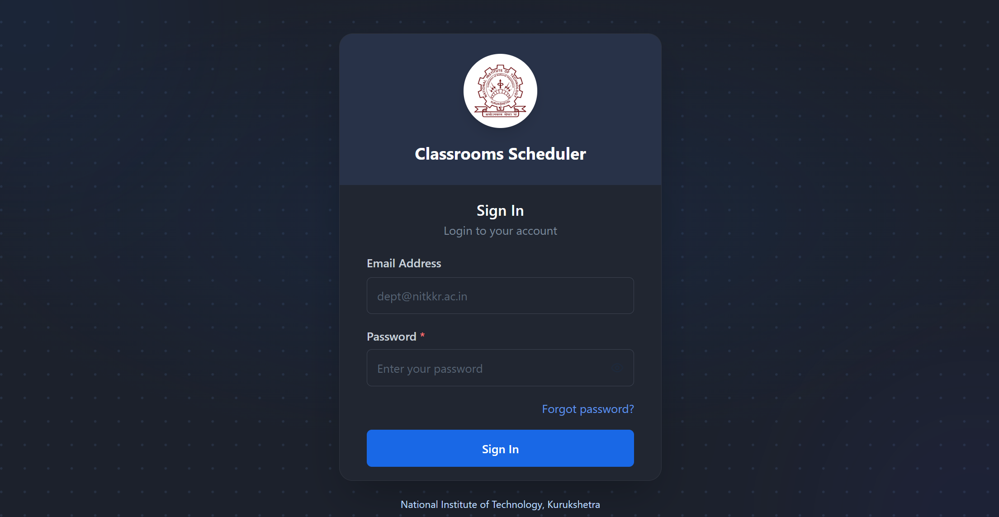
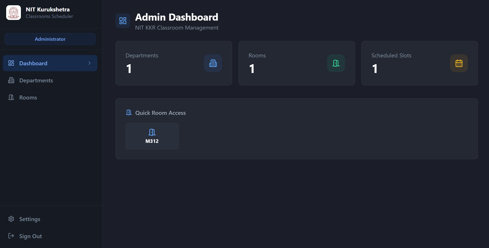
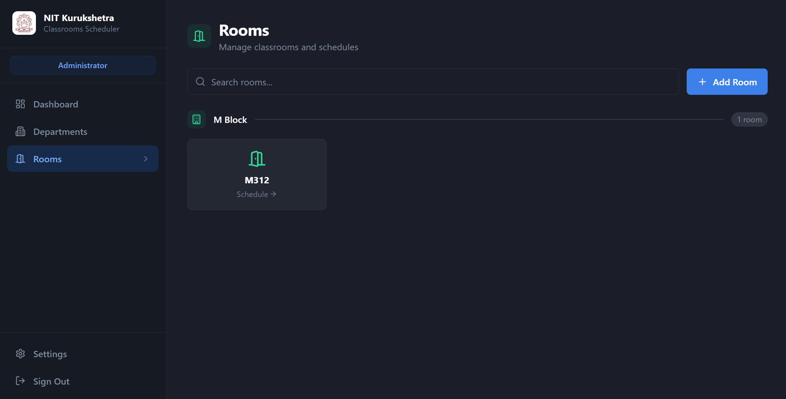
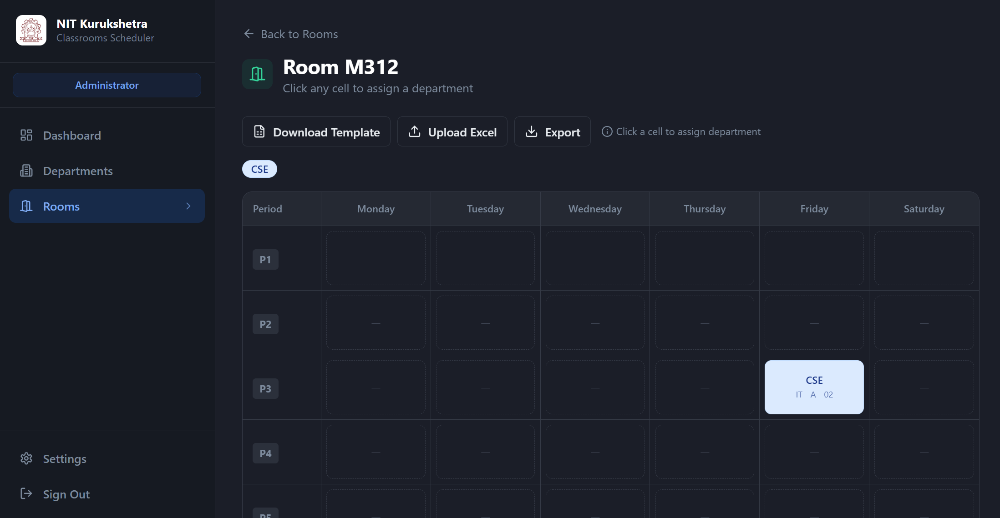
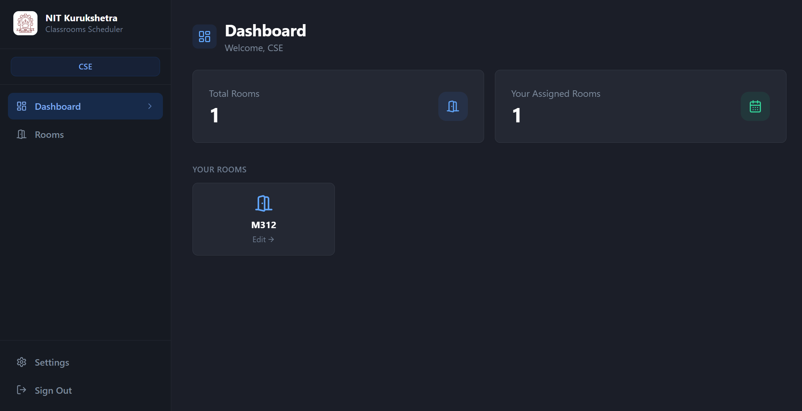
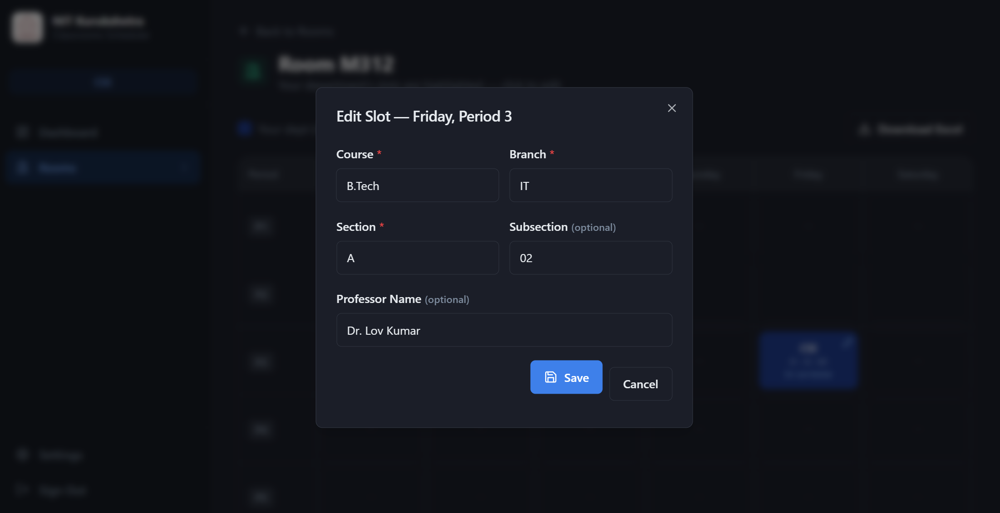

<div align="center">


# 🏛️ NIT KKR Classroom Scheduler

**A modern, role-based classroom timetable management system for NIT Kurukshetra**


[Live Demo](https://classrooms-nitkkr.vercel.app)

</div>

---

## 📸 Preview

<div align="center">

| Login | Admin Dashboard |
|:---:|:---:|
|  |  |

| Rooms Browser | Admin Schedule Editor |
|:---:|:---:|
|  |  |

| Department Dashboard | Dept Schedule Editor |
|:---:|:---:|
|  |  |

</div>

---


## 👥 User Roles

There are **two types of users** in this system:

### 🛡️ Admin

Admins have full control over the system. Admin accounts are **not created through the UI** — they are provisioned directly in Supabase.

**Admin workflow:**

```
Add Departments  →  Add Rooms  →  Assign Room Schedules
```

**What an admin can do:**

- **Dashboard** — See an overall summary: total rooms, total departments, quick navigation links
- **Manage Departments** — Add, edit, and delete department accounts
  - On adding a department, the system auto-generates a password and **sends a welcome email** with login credentials
- **Manage Rooms** — Add rooms using building-prefixed codes (e.g. `M312`, `E201`, `L102`, `MCA302`)
- **Assign Room Schedules** — Two methods:
  - **UI Method** — Open the schedule editor → select a department from a dropdown for each day/period slot
  - **Excel Method** — Download the template → fill it in → upload → save 
- **Update Schedules** — Edit any room's schedule at any time using either method above
- **Delete** rooms and departments permanently

> **Multiple admins are supported.** similarly like adding 1st admin user.

---

### 🏫 Department Head

Department users **cannot self-register**. Their accounts are created exclusively by an Admin.

**Department workflow:**

```
Receive Welcome Email  →  Login  →  Browse Rooms  →  Fill Your Schedule Cells
```

**What a department user can do:**
- **Dashboard** — Personalised summary with quick links
- **Browse Rooms** — View all classrooms, searchable and grouped by building prefix
- **View Schedule** — Click any room to see its full weekly schedule
  - Own department's slots are **highlighted with a gold border** ✦
  - Other departments' slots are visible but **read-only**
- **Edit Own Cells** — Click a highlighted slot to fill in:

  | Field | Required |
  |-------|----------|
  | Course / Subject | ✅ Yes |
  | Branch (e.g. CSE, ECE, ME) | ✅ Yes |
  | Section (e.g. A, B, C) | ✅ Yes |
  | Subsection (e.g. A1, B2) | ⬜ Optional |
  | Professor Name | ⬜ Optional |

- **Download Excel** — Export any room's complete schedule as a formatted `.xlsx` file

---

## 🛠️ Tech Stack

| Layer | Technology | Why |
|---|---|---|
| **Frontend** | Next.js 14 (App Router) | Full-stack React, SSR, API routes, fast |
| **Styling** | Tailwind CSS | Utility-first, fully responsive |
| **Database** | PostgreSQL via Supabase | Relational DB with Row-Level Security |
| **Auth** | Supabase Auth | Email/password, forgot password, secure sessions |
| **Email** | Nodemailer + Gmail | Welcome emails and password reset |
| **Excel I/O** | SheetJS (xlsx) | Template download, import, and export |
| **Language** | TypeScript | Type safety across frontend and backend |
| **Deployment** | Vercel | Auto-deploy from GitHub, edge hosting |

---

## 🚀 Getting Started

### Prerequisites

- [Node.js](https://nodejs.org/) v18+
- [npm](https://www.npmjs.com/) v9+
- A [Supabase](https://supabase.com/) account (free tier works)
- A Gmail account with [App Password](https://myaccount.google.com/apppasswords) enabled

---

### Installation

**1. Clone the repository**

```bash
git clone https://github.com/your-username/nitkkr-classrooms.git
cd nitkkr-classrooms
```

**2. Install dependencies**

```bash
npm install
```

---

### Supabase Setup

**Step 1 — Create a Supabase project**

Go to [supabase.com](https://supabase.com) → New Project. Note your:
- Project URL
- `anon` public key
- `service_role` secret key *(Settings → API)*

**Step 2 — Run the database schema**

In Supabase → **SQL Editor**, run:

```sql
-- Departments table (linked to Supabase auth.users)
CREATE TABLE public.departments (
  id UUID REFERENCES auth.users(id) ON DELETE CASCADE PRIMARY KEY,
  name TEXT NOT NULL,
  email TEXT NOT NULL UNIQUE,
  is_admin BOOLEAN DEFAULT FALSE
);

-- Rooms table
CREATE TABLE public.rooms (
  id UUID DEFAULT gen_random_uuid() PRIMARY KEY,
  name TEXT NOT NULL UNIQUE
);

-- Schedules table
CREATE TABLE public.schedules (
  id UUID DEFAULT gen_random_uuid() PRIMARY KEY,
  room_id UUID REFERENCES public.rooms(id) ON DELETE CASCADE,
  day_of_week VARCHAR(10) NOT NULL,
  period_number INTEGER NOT NULL CHECK (period_number >= 1 AND period_number <= 8),
  department_id UUID REFERENCES public.departments(id),
  course TEXT,
  branch TEXT,
  section TEXT,
  subsection TEXT,
  professor_name TEXT,
  UNIQUE(room_id, day_of_week, period_number)
);

-- Enable Row-Level Security
ALTER TABLE public.departments ENABLE ROW LEVEL SECURITY;
ALTER TABLE public.rooms ENABLE ROW LEVEL SECURITY;
ALTER TABLE public.schedules ENABLE ROW LEVEL SECURITY;

-- RLS Policies
CREATE POLICY "Anyone can view departments" ON public.departments FOR SELECT USING (true);
CREATE POLICY "Anyone can view rooms" ON public.rooms FOR SELECT USING (true);
CREATE POLICY "Anyone can view schedules" ON public.schedules FOR SELECT USING (true);

CREATE POLICY "Admins can insert rooms" ON public.rooms FOR INSERT
  WITH CHECK (EXISTS (SELECT 1 FROM public.departments WHERE id = auth.uid() AND is_admin = true));
CREATE POLICY "Admins can update rooms" ON public.rooms FOR UPDATE
  USING (EXISTS (SELECT 1 FROM public.departments WHERE id = auth.uid() AND is_admin = true));
CREATE POLICY "Admins can delete rooms" ON public.rooms FOR DELETE
  USING (EXISTS (SELECT 1 FROM public.departments WHERE id = auth.uid() AND is_admin = true));

CREATE POLICY "Admins can insert schedules" ON public.schedules FOR INSERT
  WITH CHECK (EXISTS (SELECT 1 FROM public.departments WHERE id = auth.uid() AND is_admin = true));
CREATE POLICY "Admins can update schedules" ON public.schedules FOR UPDATE
  USING (EXISTS (SELECT 1 FROM public.departments WHERE id = auth.uid() AND is_admin = true));
CREATE POLICY "Admins can delete schedules" ON public.schedules FOR DELETE
  USING (EXISTS (SELECT 1 FROM public.departments WHERE id = auth.uid() AND is_admin = true));

CREATE POLICY "Departments update own schedules" ON public.schedules FOR UPDATE
  USING (department_id = auth.uid()) WITH CHECK (department_id = auth.uid());

CREATE POLICY "Departments can update own info" ON public.departments FOR UPDATE
  USING (id = auth.uid()) WITH CHECK (id = auth.uid());
```

**Step 3 — Create your first Admin user**

In Supabase → **Authentication → Users → Add User**:
- Enter admin email and password
- Enable **Auto Confirm User** ✅
- Copy the generated **UUID**

Then in SQL Editor:

```sql
INSERT INTO public.departments (id, name, email, is_admin)
VALUES (
  'PASTE-YOUR-ADMIN-UUID-HERE',
  'Administrator',
  'admin@nitkkr.ac.in',
  true
);
```

**Step 4 — Disable email confirmation** *(for development)*

Supabase → **Authentication → Settings** → toggle **"Enable email confirmations"** → **OFF**

---

### Environment Variables

Copy the example file and fill in your values in .env.local:

```bash
cp .env.local.example .env.local
```


> **How to get a Gmail App Password:**
> Google Account → Security → 2-Step Verification → App Passwords → Select "Mail" → Generate

---

### Running Locally

```bash
npm run dev
```

Open [http://localhost:3000](http://localhost:3000) and log in with your admin credentials.


---


## 🔐 Security

- **Row-Level Security** — Enforced at PostgreSQL level. Departments can only `UPDATE` their own schedule slots, regardless of application logic
- **Service Role Key** — Only used server-side in API routes; never sent to the browser
- **No self-registration** — All accounts are created by an admin; there is no public sign-up page
- **Secure sessions** — Supabase Auth

---

<div align="center">

Built with ❤️ for **NIT Kurukshetra**

</div>